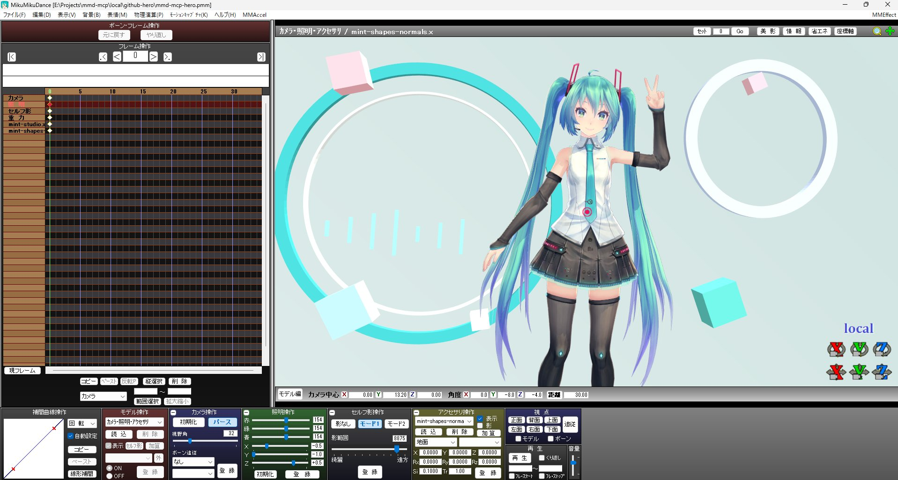

# mmd-mcp

日本語 | [English](README.en.md)

MikuMikuDanceの制作操作とMME設定を扱うWindows用stdio MCPサーバーです。キャラクター・カメラ・照明・物理、タイムライン編集、EMMの編集と実機反映、画像・音声付きAVI出力に対応します。MMD本体・MME・MMAccelのDLLを置き換えず、コンピュータユーズやマウス座標操作も使いません。



mmd-mcpで制作したシーンをMMD上に表示。モデル：Tda式初音ミクV4X／Tda。初音ミク © Crypton Future Media, INC. [画像のクレジット](assets/CREDITS.md)。

## 対応環境

検証環境は日本語配布版 **MMD 9.32 x64、日本語Windows、Python 3.10 x64** です。同じ実行ファイルの日本語モードと内蔵の **English Mode** に対応します。英語OS上の通し検証は未実施です。

## ボーン選択DLLの仕組み

ボーン情報と名前指定による選択は、次のSHA-256のMMD実行ファイルに限定します。

```text
07516fd3bf1e6b1339836b6773a156f61bdd6f848eeb621fdda012375df313a1
```

ボーン選択には自作の小さなDLLをMMDのUIスレッドへ一時的に読み込み、MMD自身の選択処理を呼びます。処理後にフックを解除します。これは保証された公開APIではなく、検証した実行ファイルの内部構造に依存する方式です。未対応ビルドは拒否します。

## 導入

Python x64とVisual Studio 2022／Build Toolsの「C++によるデスクトップ開発」を用意し、開発フォルダで実行します。

```powershell
python -m venv .venv
.\.venv\Scripts\python.exe -m pip install -e .
cmd /c scripts\build_native.cmd
```

再現用の依存一覧は `requirements-lock.txt` です。現在はソース配布のため、上記の手順で自分の環境からDLLをビルドします。DLLはmmd-mcpのパッケージ内に生成されるため、MMDフォルダへコピーする必要はありません。

ビルド済みwheelの公開は[Microsoft製部分の配布条件確認](THIRD_PARTY_NOTICES.md)が完了するまで保留です。以下は自分で生成したwheel等を使う場合の手順で、wheelからの導入にはC++環境が不要です。

```powershell
.\.venv\Scripts\python.exe -m pip install .\dist\mmd_mcp-0.3.0-py3-none-win_amd64.whl
```

MCPクライアントにstdioサーバーとして登録します。以下のパスは配置先に変更してください。

```json
{
  "mcpServers": {
    "mmd": {
      "command": "C:/Tools/mmd-mcp/.venv/Scripts/python.exe",
      "args": ["-m", "mmd_mcp.server"]
    }
  }
}
```

MCPクライアント（Codex・Claude Code 等）から制作用MMDを起動する場合は、インストール先のPythonで次を使えます。

```powershell
python -m mmd_mcp.launcher "C:/MMD/MikuMikuDance.exe"
```

WindowsのローカルWMI経由で起動元のMCPクライアントと独立したプロセスを作り、ジョブ非所属を確認してからMMDを実行します。起動に失敗した場合、通常の子プロセスとして再起動はしません。戻り値のPIDを `mmd_list_windows` と照合してください。起動元のMCPクライアントの終了に伴う巻き込みを防ぐための経路で、MMD自身のクラッシュやWindows終了を防ぐものではありません。

通常利用ではMMDを先に起動します。サーバーはMMDの自動起動やネットワーク待受を行いません。複数起動時は `mmd_list_windows` の `hwnd` を各呼び出しへ渡します。

## ツール

v0.3.0の公開MCPツールは50個です。ボーン・表情・カメラ・アクセサリのキー書き込みは、1件でもバッチ形式を使います。[ネイティブ編集の手順](docs/native-editing.md) と [全機能の対応表](docs/coverage.md) も参照してください。

| ツール | 内容 |
| --- | --- |
| `mmd_list_windows` | MMDのHWND・PID・タイトル |
| `mmd_capture_window` | UIを含むウィンドウ全体のPNG |
| `mmd_list_models` / `mmd_select_model` | モデル一覧・名前またはインデックスで選択。0はカメラ・照明・アクセサリ |
| `mmd_get_ui_state` | 表示フレーム、モデル、表情一覧・表示値、IK選択欄 |
| `mmd_list_bones` / `mmd_select_bone` | ボーン一覧・名前またはインデックスで単一選択 |
| `mmd_get_selected_bone_transform` | 選択名・選択数と位置・回転の表示値 |
| `mmd_get_camera` | カメラ中心位置・回転・距離・画角・パースを読む |
| `mmd_get_light` | ライトのRGB色・方向を読む |
| `mmd_set_frame` | 表示フレームを移動 |
| `mmd_load_file` | `model`=PMD/PMX、`project`=PMM、`pose`=VPD、`motion`=VMD、`accessory`=X、`audio`=WAV、`background_image`=背景画像、`background_video`=AVI |
| `mmd_save_project` | PMM保存。既存ファイルは `overwrite=true` が必要 |
| `mmd_get_dialogs` | 所有モーダルの文字・ボタンを取得 |
| `mmd_get_model_profile` | PMD/PMXの初期ボーン位置・構成と対応プロファイル |
| `mmd_compile_pose` | モデル別の意味ベースポーズ生成（`hand_at`／`palm_facing` の目標は順運動学で解き、`fk` で手首位置と掌の向きを返す） |
| `mmd_read_motion_document` / `mmd_edit_motion_document` | 編集用JSONの読み込み・キー追加／変更／削除 |
| `mmd_write_motion_document` | 編集用JSONまたは補間付きVMDを新規保存 |
| `mmd_preview_motion` | 連続フレームのPNG・コマ一覧・時刻に合わせたAVI |
| `mmd_list_accessories` / `mmd_select_accessory` | アクセサリ一覧と明示選択 |
| `mmd_get_accessory` | 選択アクセサリの位置・回転・サイズ・透明度・表示・影・親を読む |
| `mmd_batch_bone_keys` | アクティブモデルのボーン・表情をフレーム別に一括設定・キー登録（意味ポーズ／明示ボーン値／表情を混在可。1フレーム1ボーンなら単発編集） |
| `mmd_batch_camera_keys` | カメラ・ライト・セルフ影・重力をフレーム別に一括設定・キー登録 |
| `mmd_read_effect_assignments` / `mmd_write_effect_assignments` | MMEのEMMをMain・環境光・材質・影等のセクション別に読み取り／一括編集。材質単位と表示切替にも対応 |
| `mmd_batch_model_flags` | 表示・IK・外親パネルをフレーム別に一括（表示／セルフ影／加算、IKのON/OFF、外部親、登録） |
| `mmd_batch_accessories` | アクセサリの読み込み・フレーム別の値／親設定・キー登録を1回で実行（1個でも複数でも同じ） |
| `mmd_delete_accessories` | 複数アクセサリを降順で一括削除。MMDの確認ダイアログを文言完全一致でのみ受諾 |
| `mmd_get_scene_settings` / `mmd_set_scene_settings` | 表示・物理・音声・MME設定を読み、指定状態へ変更・照合 |
| `mmd_set_render_style` | モデルのエッジ太さ・色、地面影の明るさ |
| `mmd_output_size` | 出力サイズの読み取り・変更・再確認 |
| `mmd_model_order` | 描画順・計算順の読み取りと並べ替え |
| `mmd_get_gravity` | 現在の重力・ノイズ設定を読む |
| `mmd_get_playback` / `mmd_set_playback` | 再生状態、開始・終了範囲、ループ、再生・停止 |
| `mmd_get_timeline_context` / `mmd_select_key_range` | トラック名と範囲を取得し、キーを範囲選択 |
| `mmd_edit_actions` | ボーン／キーのコピー・貼り付け・削除、列挿入、選択、初期化、元に戻す等 |
| `mmd_transform_timeline` | 時間拡大、位置角度補正、表情補正、まばたき、リップ時刻、物理フラグ変換 |
| `mmd_export_file` | MMD標準のVPD・VMD・画像出力 |
| `mmd_export_video` / `mmd_get_video_export_status` | 明示範囲・fps・コーデックによるAVI出力と完了確認 |
| `mmd_inspect_vmd` / `mmd_edit_vmd` | VMDのキーを読み、時刻・削除・ボーン／カメラ補間を新規ファイルへ編集 |
| `mmd_transfer_effect_assignments` | MME設定をEMMへ保存／EMMから読込。PMM再読込は不要 |
| `mmd_delete_models` / `mmd_new_project` | 明示したモデルの削除、現在シーンを破棄して新規作成 |

共通の動作：ボーン選択を伴う操作は、パネルがBOX選択などのモードなら自動で「選択」へ戻します。変更前のモードは `operation_mode_switched_from` に返します。

## 操作例

各行はツール名とJSON引数です。名前は実際のモデルから取得します。

```text
mmd_select_model                 {"name":"初音ミク"}
mmd_set_frame                    {"frame":30}
mmd_select_bone                  {"name":"左腕"}
mmd_batch_bone_keys              {"items":[{"frame":0,"bones":[{"name":"左腕","rotation_degrees":{"z":-20}}],"morphs":[{"category":"eyes","name":"まばたき","weight":0.5}]}]}
mmd_select_model                 {"selector_index":0}
mmd_batch_camera_keys            {"items":[{"frame":0,"camera":{"position":{"x":2,"y":11},"distance":38,"fov_degrees":35},"light":{"color":{"r":190,"g":150,"b":120},"direction":{"x":-0.4,"y":-0.8,"z":0.3}}}]}
mmd_capture_window               {}
mmd_save_project                 {"path":"E:/MyProject/scene.pmm"}
```

省略軸は指定しません。位置はMMD単位、回転は数値欄と同じ度数です。カメラ位置は視点ではなくカメラ中心座標です。ライトRGBは整数0～255、方向は各軸−1～1、表情ウェイトは0～1です。

フレーム移動はアニメーションを評価するため、未登録の編集がキーの値に置き換わる場合があります。残したい編集は先に登録します。編集・キー登録・保存は独立した操作です。

## ファイル操作

絶対パスを指定します。モデル情報は応答に返します。PMM読み込みは現在のシーンを置き換えます。VPD/VMD読み込みは独立した機能で、直接ボーン操作の代用には使いません。

VMDは現在フレームを起点に取り込みます。ファイル内の時刻をそのまま使う場合は先に0フレームへ移動します。モデル用VMDは対象モデルを、カメラ・ライト用VMDはモデル選択インデックス0を選んでから読み込みます。

VPDはキー登録を伴わないポーズ読み込みです。MMDが数値欄を更新しない場合に備え、既存の単一選択を保って表示を同期します。複数選択時は `transform_panel_refresh_required` に従い、ボーンを明示選択してから数値編集します。

`status` が `completed` 以外の場合は応答を確認します。不明なダイアログは受諾せず残します。`mmd_get_dialogs` で内容を確認し、MMD上で解決してから次の操作へ進みます。タイムアウト後に無条件で再実行すると重複読み込みになる場合があります。

## ポーズ・モーション制作

`mmd_get_model_profile` はPMD/PMXの読み取り専用調査にも対応します。`bone_name` または `bone_index` で親階層・軸・付与・IKを調べ、宣言値と初期配置からの推定を区別します。詳細は [制作経路](docs/authoring.md) を参照。

基本検証モデルは **Tda式初音ミクV4X Ver1.00** です。モデルファイルは利用者が用意します。意味ベースの操作はファイルのSHA-256により対応を限定し、Tda V4X、同梱のあにまさ式ミク1.3、MEIKOで確認しています。PMD/PMXの骨格情報を読むことと、任意のモデルで自然なポーズを作れることは別です。

`mmd_compile_pose` は肩上げ、腕上げ、肘曲げ、前腕方向のひねり、手のジェスチャーなどから名前付きボーンキーを生成します。実機への適用は `mmd_batch_bone_keys` に `model_path` とフレームごとの `pose` を渡します。明示的な `bones` と `morphs` も同時に指定できます。キー登録は各項目の `register_key`（既定true）で制御し、登録せず試す場合はfalseにします。VPD/VMD読み込み・PMM保存は別操作です。Tdaでは手捩り・上半身2・親指0も扱います。モデル本体の改造はしません。

新しいモーションはJSONに主要キーと各軸／回転の補間曲線を保持します。`mmd_edit_motion_document` は更新後のデータを返す純粋操作で、ファイルやMMDを変更しません。`mmd_write_motion_document` は新規保存専用です。既存PMMの全キーを取り出す機能や、任意のVMDを逆変換する機能ではありません。

補間は到着側のキーに持たせます。VMD出力の回転はMMDボーン数値欄の規約を使い、通常のXYZ Eulerとは異なります。詳細は [制作経路](docs/authoring.md) を参照してください。

`mmd_preview_motion` は指定区間を最大180サンプルにしてPNG、コマ一覧、MJPG AVIを生成します。`allow_frame_evaluation=true` が必要です。成功時は元フレームへ戻りますが、未登録の編集は復元しません。これはフレーム評価によるプレビューで、リアルタイム録画や物理ベイクではありません。

専用スキルは [skills/mmd-pose-motion](skills/mmd-pose-motion/SKILL.md) にあります。MCPクライアント（Codex・Claude Code 等）が対応するスキル配置先へ置くと、ポーズ・モーション・アクセサリ制作時に利用できます。MCPサーバーを更新した後は、クライアント側でMCPを再接続して新しいツール一覧を読み込んでください。

## アクセサリ

インデックス0のカメラ・照明・アクセサリモードで扱います。読むのは `mmd_list_accessories` → `mmd_select_accessory` → `mmd_get_accessory`。書くのは1個でも複数でも `mmd_batch_accessories` です。

親モデルのインデックスは `mmd_get_accessory` の親選択欄から取得します。0は地面で、モデルへ取り付ける場合はボーン名も指定します。親の変更はローカル変換を保持するため、ワールド位置が変わります。親はキーの `parent_model_index` / `parent_bone_name` で指定し、数値より先に適用されます。

`mmd_batch_accessories` は各項目は `path`（新規読み込み）か `selector_index`（既存）のどちらか一方と、フレームごとの `keys`（位置・回転・拡大・透明度・表示・影・`register_key`）を持ちます。読み込みを先に全て行い、その後フレーム昇順に1フレームずつ入って全項目を設定・登録します。文脈確認はバッチ開始時とフレーム移動時に行い、項目ごとは選択欄のずれだけを確認します。失敗した時点で止まり、適用済みの内容を返します（取り消しは行いません）。削除は `mmd_delete_accessories` に `[{selector_index, expected_name}, …]` を渡します。全項目を現在の一覧と照合してから、大きいインデックスから順に消します。確認ダイアログは「アクセサリ削除」のタイトルと本文、OKボタンが全て一致した時だけ受諾し、それ以外は開いたまま `dialog_requires_action` を返します。実測は10個の位置＋キー登録が3.3秒、3個の読み込み＋2フレーム分の登録が4.5秒でした。

## MME割当

`mmd_read_effect_assignments` の `objects` と `effect_sections` から対象ID・セクション名を取得し、`mmd_write_effect_assignments` の `sections` に複数セクションの `assignments`／`visibility` を渡します。材質IDは `Pmd3[173]` 形式で、UIの選択インデックスとは別です。Main用の従来の `assignments` 引数も使えます。`output_path` を指定すれば元のEMMを保ったまま新規出力できます。

この2ツールはファイル編集のみです。実機への反映には `mmd_transfer_effect_assignments(operation="import", path=...)` を使います。`operation="export"` で現在の割当を保存でき、編集後の再エクスポートで反映を照合します。PMM再読み込みも可能ですが、シーンが置き換わります。対象エフェクトの読み込み後に現在の割当をEMMへ出力してから編集します。詳細と引数例は [MME割当](docs/effects.md) を参照してください。

## 制約

- 呼び出し中はモデル・ボーン・フレーム・入力欄を手動変更しないでください。再生中、最小化中、モーダル表示中の通常編集は拒否します。
- 複数フィールドは順に適用します。途中失敗時は一部が残る場合があり、自動ロールバックはしません。返却値とキャプチャで確認します。
- 数値はUIの丸め値です。内部計算精度の完全なシーンダンプではありません。
- 曖昧な名前指定は拒否します。モデル／ボーンのインデックスは読み込み直しをまたぐ永続IDではありません。
- ボーン一覧には内部・先端ボーンも含みます。UIに出ないボーンの選択は拒否します。IK・物理・移動可否等の制約はMMD自身が評価します。
- カメラ・ライトは先にインデックス0を選択し、パネルを展開します。ボーン操作はボーン編集モードが必要です。
- WGCは現在の表示を撮影します。厳密な描画同期とビューポートのみの切り抜きは未実装です。
- MMEはEMMの保存・編集・読込と、Main／オフスクリーン／材質／表示設定に対応します。PMM全体を直接解析する機能はありません。キーは選択してVMD出力・検査します。VMDには保存されないアクセサリ・重力・外部親等はPMMで保持します。
- VMD読込はキーをマージします。時刻変更・削除済みのVMDを読んでも古いキーは消えません。必要な範囲を先に削除してから読み込みます。
- 元に戻す／やり直しはMMD側が利用可能な操作に限ります。カメラ編集やモデル削除等を万能に取り消すものではありません。
- AVI出力ジョブは同じMCPサーバープロセスで完了を確認します。出力中は通常編集を拒否します。コーデックの独自設定画面、UI言語を切り替える専用ツール、Kinect、VSQリップシンク等は未対応です。
- ライブのモデル照合はボーン名と順序によるものです。UIからロード元ファイルのハッシュは証明できないため、指定したモデルファイルと実際の対象を利用者が対応させてください。
- プロファイルのPMX読み取りはボーン節までです。モデル全体の整合性や物理設定を検証するパーサーではありません。

## 検証・配布ビルド

```powershell
.\.venv\Scripts\python.exe -m unittest discover -s tests -v
.\.venv\Scripts\python.exe scripts/smoke_mcp.py
.\.venv\Scripts\python.exe scripts/build_package.py
```

総合実機検証はスクリプト自身が別MMDを起動して編集・終了します。既存のMMDは操作しません。

```powershell
.\.venv\Scripts\python.exe scripts/smoke_scene.py --apply --mmd-exe "C:/MMD/MikuMikuDance.exe" --model "C:/MMD/UserFile/Model/初音ミク.pmd"
```

テストには「左腕」と「まばたき」を持つ初音ミクを利用します。モデルは同梱しません。検証用PMM・PNG・JSONは `local/scene-smoke-*` に保存されます。

追加の総合テストは `scripts/smoke_release.py --apply --mmd-exe ... --model ... --second-model ...`、RayMMDの割当往復は `scripts/smoke_ray.py --apply --mmd-exe ... --model ... --ray-dir ...` です。

[対応機能](docs/coverage.md) / [制作手順](docs/authoring.md) / [編集・出力](docs/native-editing.md) / [MME割当](docs/effects.md)

MMD本体、モデル、利用者の画像・モーション・PMMは配布物に含めません。ソースの配布先は [BeamManP/mmd-mcp](https://github.com/BeamManP/mmd-mcp) です。

## UI言語とモデル内の名前

English Modeでは、モデルに英語名があると表示名も変わります。`mmd_list_bones` は内部の元名 `name` と現在の表示名 `display_name` を返し、`mmd_select_bone` はどちらでも一意なら選択できます。ボーンバッチと意味ポーズはUI言語に関係なく元名を使います（付属ミクなら表示 `arm_L`、元名 `左腕`）。表情・IK・親ボーン・タイムラインは現在のUI一覧の名前を指定してください。VMDの名前は元名のままです。

言語を切り替えたら一覧を再取得し、呼び出し中は切り替えないでください。Windows標準ダイアログはMMDとは独立してOSの言語に従います。詳しい導入と使用例は[英語README](README.en.md)にもあります。

**中国語版は未対応です。** 対応を追加する場合は、まず [ui_language.py](src/mmd_mcp/ui_language.py) のラベルとモード判定、[file_operations.py](src/mmd_mcp/file_operations.py) のファイルダイアログ、`scene_lifecycle.py`・`accessory_controls.py`・`edit_actions.py` の確認本文を確認してください。改変EXEでは [bone_state.py](src/mmd_mcp/bone_state.py) と [selection_bridge.cpp](native/selection_bridge.cpp) の文字コード・内部配置・呼出先も再検証が必要です。ハッシュを書き換えるだけでは対応できません。検証は `scripts/smoke_scene.py`・`smoke_release.py`・`smoke_editing.py` を入口にできます。

## ライセンス

自作のコード・ドキュメント・スクリプト・操作スキルは [MIT-0（MIT No Attribution）](LICENSE) です。商用利用・改変・再配布ができ、著作権表示の維持・クレジット表記・ソース公開を要求しません。無保証で提供します。

依存ライブラリと、自作DLLへ組み込まれるMicrosoftの実行用コードには、それぞれの条件が適用されます。DLLを含むパッケージのライセンス表記は `MIT-0 AND LicenseRef-Microsoft-Runtime` です。自作ソース自体はMIT-0で利用できます。条件と配布状況は [第三者ライセンスの説明](THIRD_PARTY_NOTICES.md) を参照してください。

## 変更履歴

機能追加と変更点は [CHANGELOG](CHANGELOG.md) を参照してください。
